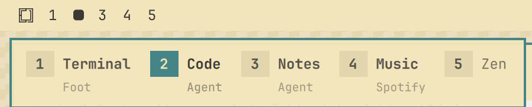

# Workspace names

An Omarchy shell plugin. Every time you actually switch workspaces, a strip
slides open in the top-left corner underneath the bar: the workspace numbers
push apart and your names unfold between them.



Name a workspace and the name is what you see. Leave it unnamed and you see
the apps that are open there instead, so the strip is useful before you have
named anything at all. Where a name is set, the open apps stay visible in
small type underneath it. The active workspace has the filled number.

## Why the switch and not the modifier key

The obvious trigger is "hold SUPER". It is also the wrong one: Hyprland
reports the press and the release of a bare modifier differently depending on
the setup, and binding it makes the strip flash on every single SUPER
shortcut you use, workspace-related or not.

So the trigger is the switch itself. The plugin watches Hyprland's focused
workspace, which means `SUPER + <number>`, `SUPER + TAB`, scrolling over the
bar and clicking a workspace number all open the strip, and nothing else
does.

## Install

```bash
omarchy plugin add https://github.com/stefanointech/omarchy-workspace-names.git --enable
```

Then add the keybindings to `~/.config/hypr/bindings.lua`:

```lua
-- Hide the strip when SUPER is released. Non-consuming, so every SUPER
-- shortcut keeps working; twice, because Hyprland reports the modifier with
-- or without its own bit set depending on the setup. If neither binding
-- fires on your machine, the strip still hides itself after `autoHideMs`.
o.bind("SUPER_L", nil, "omarchy-shell -q workspace-names hide", { non_consuming = true, release = true })
o.bind("SUPER + SUPER_L", nil, "omarchy-shell -q workspace-names hide", { non_consuming = true, release = true })

-- Name the current workspace.
o.bind("SUPER + ALT + N", "Name workspace", "omarchy-shell -q workspace-names rename 0")
```

Nothing else is required — showing the strip needs no binding at all.

## Naming workspaces

`SUPER + ALT + N` opens a small dialog for the workspace you are on. Enter
saves, Escape cancels, and an empty field clears the name again so the open
apps take its place.

Names live in `~/.config/omarchy/workspace-names.json` as a flat map, and the
plugin reloads the file when it changes — editing it by hand works fine:

```json
{
  "1": "Mail",
  "2": "Code",
  "4": "Music"
}
```

## Configuration

Settings live inline on the plugin's entry in `~/.config/omarchy/shell.json`,
so they survive an `omarchy plugin update`:

```json
{
  "plugins": [
    { "id": "stefanointech.workspace-names", "clearNameWhenEmpty": true }
  ]
}
```

| Key | Default | What it does |
|-----|---------|--------------|
| `clearNameWhenEmpty` | `false` | Forget a workspace's name once its last window is gone |

`clearNameWhenEmpty` treats a name as belonging to the work on that
workspace: close the last window and the name goes with it. Workspaces that
are already empty when the shell starts are cleared too, so the names you see
always describe something that is actually running.

The first sweep waits until Hyprland has reported both its workspaces and its
windows, plus a moment to settle. Hyprland does not deliver the two together,
and a sweep that ran too early would see every workspace as empty and throw
away exactly the names it is meant to keep.

## Optional CLI

`bin/omarchy-workspace-name` is a convenience wrapper, not a dependency. Copy
it onto your `PATH` if you want to name workspaces from a script or from the
shell:

```bash
install -m755 bin/omarchy-workspace-name ~/.local/bin/

omarchy-workspace-name rename 4        # open the dialog for workspace 4
omarchy-workspace-name set 4 Music
omarchy-workspace-name clear 4
omarchy-workspace-name list
omarchy-workspace-name show            # show the strip without switching
```

It needs `jq`, which Omarchy already ships.

## Tuning

The knobs are at the top of `WorkspaceNames.qml`:

| Property | Default | What it does |
|----------|---------|--------------|
| `autoHideMs` | `2200` | how long the strip stays when no release event arrives |
| `lingerMs` | `900` | how long it lingers after SUPER is released |
| `maxLabelWidth` | `170` | where long names and app lists get elided |

The strip's position is the `x` / `y` of the `BorderSurface` inside the HUD
`PanelWindow`; the open/close animation is `spreadAnim`.

After editing the QML, run `omarchy restart shell`. The shell's plugin
hot-reload does not reliably swap a `keepLoaded` panel.

## Requirements

Omarchy with the Quickshell-based shell (`omarchy-shell`) and Hyprland. No
other dependencies.

## License

MIT — see [LICENSE](LICENSE).
